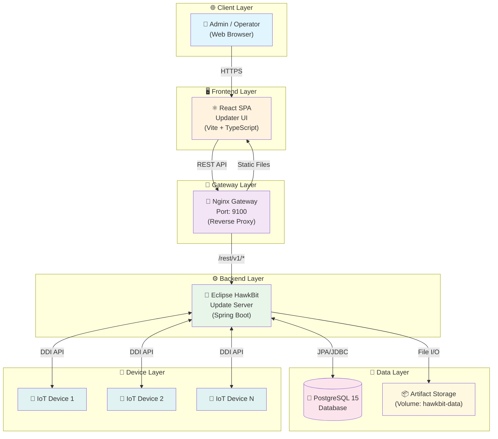
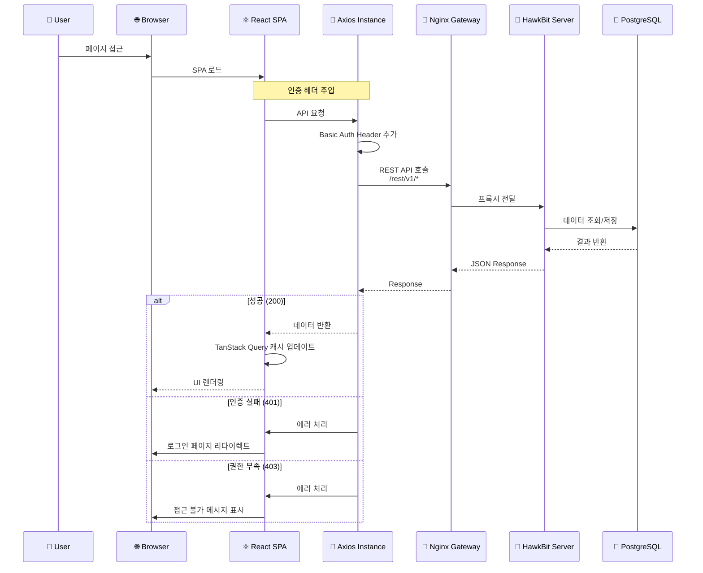
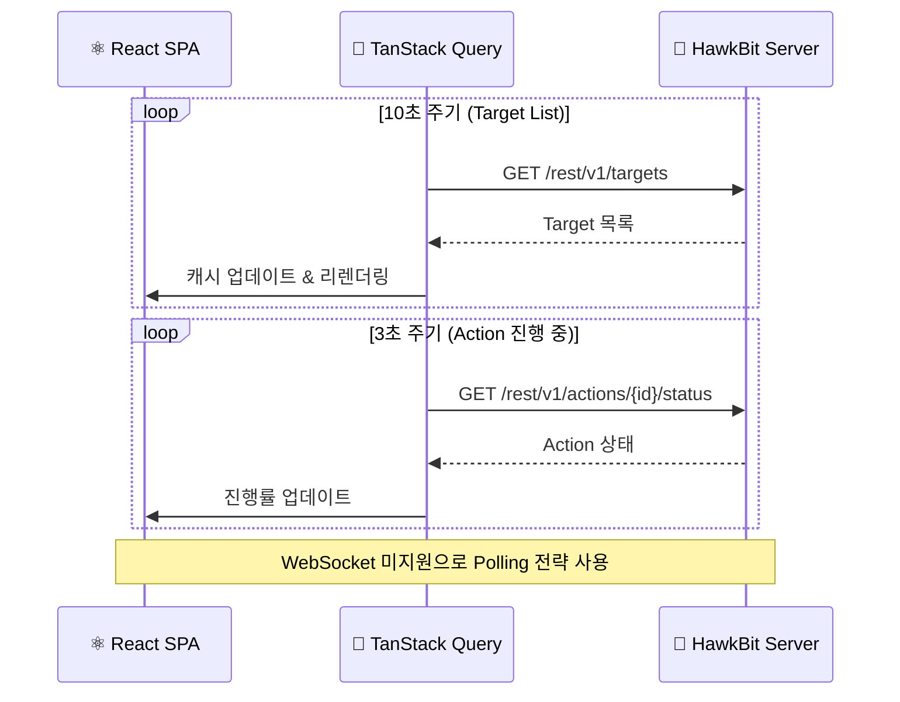
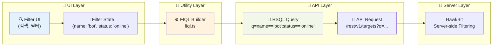
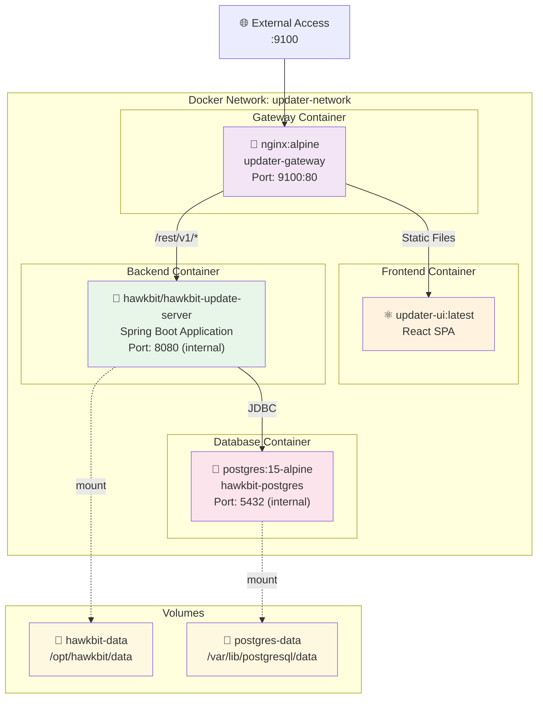
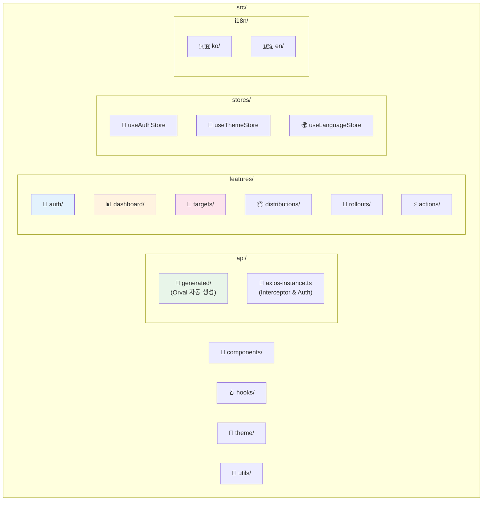
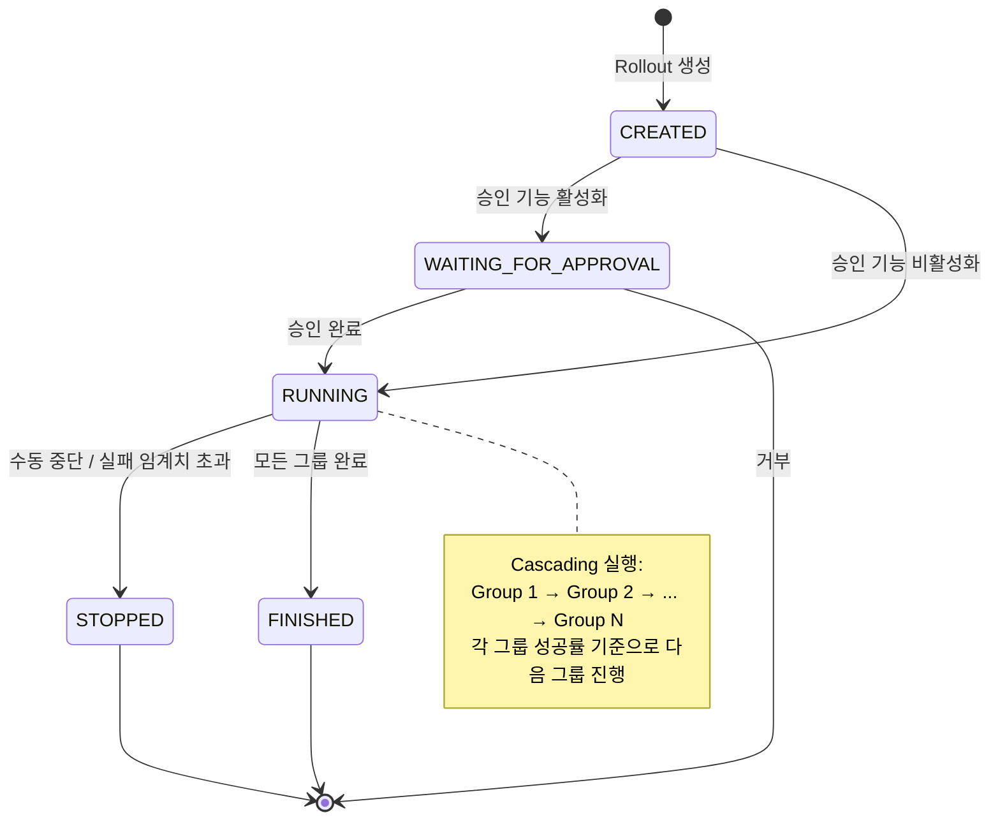

# Updater UI - 전체 아키텍처 설계도

## 1. 시스템 개요

**Updater UI**는 Eclipse HawkBit을 위한 **Headless Management UI**입니다.  
HawkBit 서버를 수정하지 않고 Management API(`/rest/v1`)를 통해 직접 통신하는 React SPA입니다.

---

## 2. 전체 시스템 아키텍처

---

## 3. 기술 스택 구성도

```mermaid
graph LR
    subgraph "Frontend Tech Stack"
        direction TB
        subgraph "Core"
            React["⚛️ React 19"]
            TypeScript["📘 TypeScript 5"]
            Vite["⚡ Vite 7"]
        end
        
        subgraph "UI & Styling"
            AntD["🐜 Ant Design 6"]
            Styled["💅 Styled Components"]
            ReactIcons["🎨 React Icons"]
        end
        
        subgraph "State Management"
            TanStack["🔄 TanStack Query v5<br/>(Server State)"]
            Zustand["🐻 Zustand v5<br/>(Client State)"]
        end
        
        subgraph "API & Utils"
            Axios["📡 Axios<br/>(HTTP Client)"]
            Orval["🔧 Orval<br/>(Code Gen)"]
            DayJS["📅 Day.js"]
            i18next["🌍 i18next"]
        end

        React --> TypeScript
        TypeScript --> Vite
        AntD --> Styled
        TanStack --> Axios
        Orval --> Axios
    end

    subgraph "Backend Tech Stack"
        direction TB
        HawkBit["🦅 HawkBit Server"]
        SpringBoot["🌱 Spring Boot"]
        PostgreSQL[("🐘 PostgreSQL 15")]
        
        HawkBit --> SpringBoot
        SpringBoot --> PostgreSQL
    end

    subgraph "Infrastructure"
        direction TB
        Docker["🐳 Docker"]
        Nginx["🔷 Nginx"]
        
        Docker --> Nginx
    end

    style React fill:#61dafb
    style TypeScript fill:#3178c6
    style Vite fill:#646cff
    style AntD fill:#0170fe
    style TanStack fill:#ff4154
    style Zustand fill:#443e38
    style HawkBit fill:#2ea44f
    style PostgreSQL fill:#336791
```

---

## 4. 통신 플로우 다이어그램

### 4.1 API 통신 플로우

### 4.2 Polling 기반 실시간 업데이트

---

## 5. 데이터 플로우 (RSQL/FIQL)

---

## 6. 인프라 구성도 (Docker Compose)

---

## 7. 프로젝트 구조도

---

## 8. Rollout 배포 플로우

---

## 9. 핵심 API 엔드포인트

| 도메인 | API 엔드포인트 | 설명 |
|:---|:---|:---|
| **Target** | `GET /rest/v1/targets` | Target 목록 조회 |
| | `GET /rest/v1/targets/{id}` | Target 상세 조회 |
| | `POST /rest/v1/targets/{id}/assignedDS` | Distribution Set 할당 |
| **Distribution** | `GET /rest/v1/distributionsets` | Distribution Set 목록 |
| | `GET /rest/v1/softwaremodules` | Software Module 목록 |
| **Rollout** | `GET /rest/v1/rollouts` | Rollout 목록 조회 |
| | `GET /rest/v1/rollouts/{id}/deploygroups` | Deploy Group 조회 |
| **Action** | `GET /rest/v1/actions` | Action 목록 조회 |
| | `GET /rest/v1/actions/{id}/status` | Action 상태 조회 |
| **System** | `GET /rest/v1/system/configs` | 시스템 설정 조회 |

---

## 10. 환경별 설정

| 환경 | 설명 | 설정 위치 |
|:---|:---|:---|
| **개발** | Vite Dev Proxy | `vite.config.ts` |
| **프로덕션** | Nginx Reverse Proxy | `docker/nginx-gateway.conf` |
| **인증** | Basic Auth | `src/api/axios-instance.ts` |
| **API 생성** | Orval | `orval.config.ts` |
