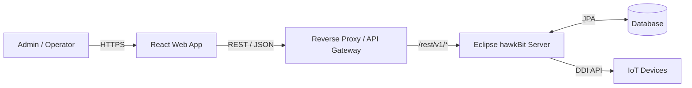

# 1. 개요 (Introduction)

## 1.1 목적 (Objective)

본 프로젝트의 주요 목표는 다음과 같다.

- **hawkBit 서버 수정 없이 그대로 사용** (Headless UI 방식)
- **Management API 기반의 운영 친화적 Web UI 제공**
- **대규모 Target/배포 운영 환경에 적합한 확장성·가독성·보안성 확보**

## 1.2 범위 (Scope)

| 구분 | 내용 |
| :--- | :--- |
| **Backend** | 기존 Eclipse hawkBit Server (Binary / Config 수정 없음) |
| **Frontend** | 신규 React 기반 SPA |
| **API** | hawkBit Management API (`/rest/v1`) |
| **제외** | hawkBit DDI(Device ↔ Server) API 직접 UI 제어 |

# 2. 시스템 아키텍처 (System Architecture)

## 2.1 전체 아키텍처 개요

본 시스템은 Headless hawkBit 아키텍처를 기반으로 하며, Frontend는 hawkBit와 직접 결합되지 않고 API 중심 통신만 수행한다.



## 2.2 통신 및 보안 전략

### Protocol
- HTTP/1.1 (REST)
- JSON / `application/hal+json` 지원

### 인증 전략

| 환경 | 방식 |
| :--- | :--- |
| **개발** | Vite Dev Proxy + Basic Auth Header 주입 |

### 권한 모델 (RBAC)
- hawkBit Management API 권한 기반 접근 제어 준수
- UI 레벨에서 메뉴/버튼/액션 권한 제어
- API 403 응답 시 사용자 친화적 안내 제공

### Query Language
- hawkBit 표준 FIQL(RSQL) 문법 사용

# 3. 기술 스택 (Technology Stack)

## 3.1 Core Stack

| 구분 | 기술 | 버전 | 선정 이유 |
| :--- | :--- | :--- | :--- |
| **Language** | TypeScript | 5.x+ | 복잡한 도메인 모델 타입 안정성 |
| **Framework** | React | 18.x+ | SPA 표준, 생태계, 장기 유지보수 |
| **Build Tool** | Vite | 5.x+ | 빠른 HMR, Proxy 설정 용이 |

## 3.2 상태 관리 & 데이터 패칭

| 구분 | 기술 | 용도 |
| :--- | :--- | :--- |
| **Server State** | TanStack Query | API 캐싱, Polling, Retry |
| **Client State** | Zustand | 로그인 정보, UI 상태 |

## 3.3 UI & UX

| 구분 | 기술 | 용도 |
| :--- | :--- | :--- |
| **UI Library** | Ant Design v5 | Admin UI 최적화 |
| **Styling** | Styled-components | 동적 테마 |
| **Icons** | React Icons | 아이콘 통합 |

## 3.4 API & Utilities

| 구분 | 기술 | 용도 |
| :--- | :--- | :--- |
| **HTTP Client** | Axios | Interceptor 기반 에러/인증 |
| **Code Gen** | Orval | hawkBit OpenAPI 기반 자동 생성 |
| **Date** | Day.js | 경량 날짜 처리 |

# 4. 프로젝트 구조 (Project Structure)

기능(Feature) 중심 구조를 채택한다.

```
src/
├── api/
│   ├── generated/          # Orval 자동 생성 코드
│   └── axios-instance.ts   # Interceptor, Base URL
├── components/             # 공통 UI 컴포넌트
├── features/
│   ├── auth/
│   ├── targets/
│   ├── distributions/
│   ├── rollouts/
│   └── actions/
├── hooks/
├── stores/
├── utils/
├── App.tsx
└── main.tsx
```

# 5. 핵심 구현 전략 (Implementation Strategies)

## 5.1 RSQL(FIQL) Query Handling
- 모든 List 화면은 Server-side Filtering만 허용
- UI Filter State → RSQL 문자열 변환 빌더 구현

```javascript
// Example
{
  name: "bot",
  status: "online"
}
// → name=="bot";status=="online"
```

## 5.2 실시간 상태 갱신 (Polling)
- hawkBit는 WebSocket 미지원 → Polling 기반 상태 동기화

| 화면 | 주기 |
| :--- | :--- |
| **Target List** | 10초 |
| **Action 진행 중** | 3초 |
| **Rollout 상세** | 상태 변경 시만 활성 |

## 5.3 대용량 파일 업로드
- `multipart/form-data` 방식
- `Axios.onUploadProgress` 사용
- **UI 요구사항**:
  - 진행률 표시
  - 취소 / 실패 재시도

## 5.4 CORS & Proxy 설정 (개발 환경)

```typescript
// vite.config.ts
export default defineConfig({
  server: {
    proxy: {
      '/rest': {
        target: 'http://HAWKBIT_SERVER:HAWKBIT_SERVER_PORT',
        changeOrigin: true,
        secure: false,
      },
    },
  },
});
```